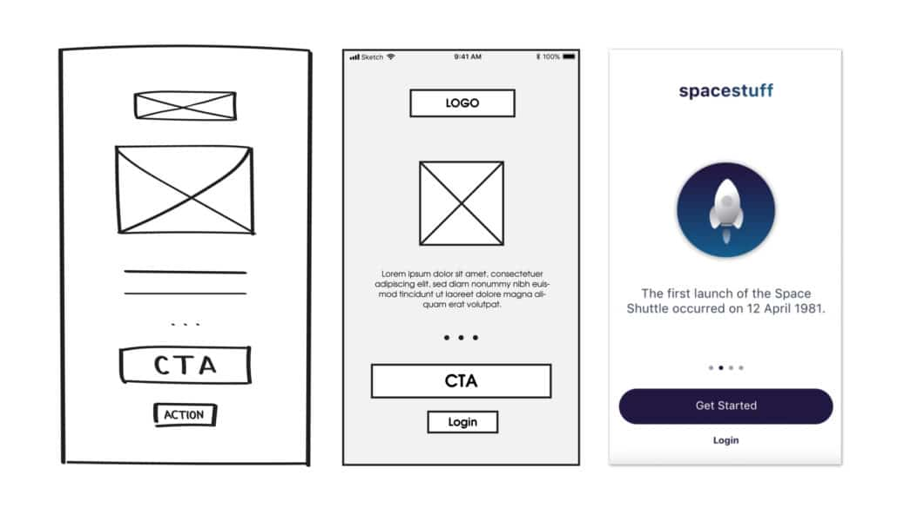
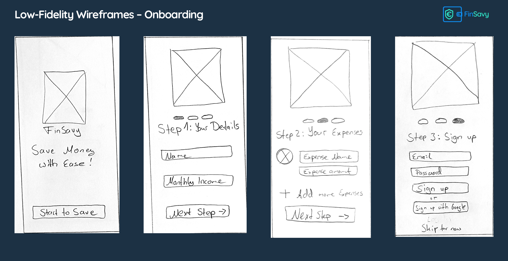
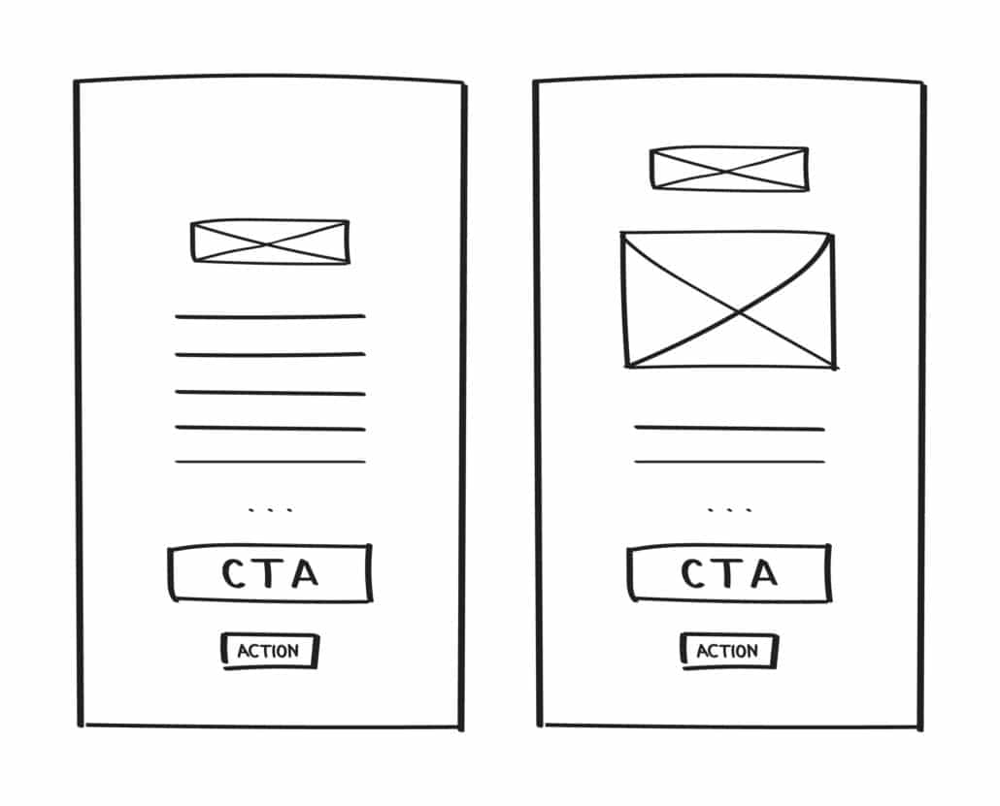
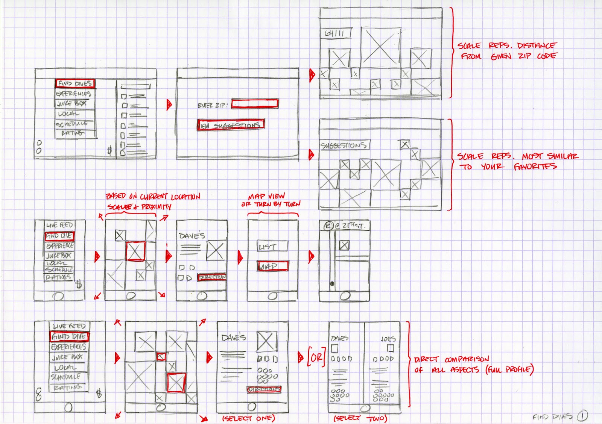
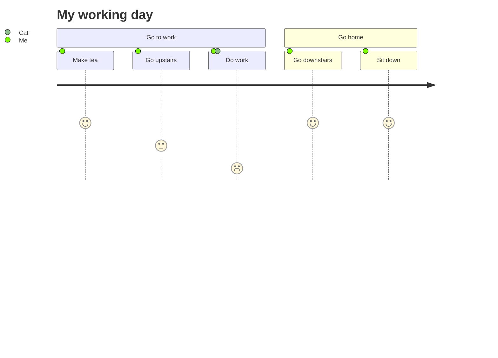

# IPM 2022/23. Práctica individual

El objetivo de esta práctica es el **diseño de una interface de
usuaria (IU)** para la aplicación que se describe más adelante.

La práctica de realiza de manera individual y consta de dos fases:

  1. `12/09/2022T00:00` - `16/09/2022T23:59`: Esta fase abarca el
     diseño propiamente dicho.
	 
	 El resultado esperado es la documentación del diseño.
	 
  2. `19/09/2022T00:00` - `23/09/2022T23:59`: Esta fase consiste en una
     [revisión por pares](https://en.wikipedia.org/wiki/Peer_review)
     del trabajo realizado en la fase anterior.
	 
	 El resultado esperado son los informes de revisión.
	 
Los resultados de ambas fases se subirán al espacio asignado a la
asignatura en el campus virtual de la universidad, usando la tarea
creada para tal propósito.

> :warning: No es posible realizar la segunda fase sin haber
> completado la primera dentro del período de tiempo establecido.

> :warning: Los resultados de esta práctica se usarán en la primera
> práctica en grupo.

## La aplicación

La aplicación para la que estamos diseñando la interface es una
aplicación con una [interface gráfica de
escritorio](https://en.m.wikipedia.org/wiki/Graphical_user_interface).

> :note: El servicio proporciona más utilidades e información que la
> que maneja nuestra aplicación.

El caso de uso principal es realizar consultas al servicio
[cheat.sh](http://cheat.sh) sobre el uso de los comandos unix.

El código fuente y a información completa sobre el servicio los
podemos encontrar en
[github.com/chubin/cheat.sh](https://github.com/chubin/cheat.sh).

## Fase 1: Diseño

En esta fase tenemos que diseñar al interface de la aplicación y
obtener como resultado la documentación donde se describe dicho
diseño.

Por desgracia no existe un lenguaje estandarizado para especificar el
diseño de una interface de usuaria. Es decir, no disponemos de un
lenguaje análogo a los que usamos en diseño software como UML o C4.
Los lenguajes usados de basan en las convenciones y las normas
establecidas en cada organización.

El diseño de la interface tiene que cubrir dos aspectos principales:
_estático_ y _dinámico_.

### La parte estática

La parte estática muestra la composición de la interface: los
elementos que la conforman y la disposición espacial de los mismos.

Al tratarse de interfaces gráficas, esta parte se expresa, como
cabría esperar, en su mayoría mediante un lenguaje gráfico. Ya
hemos dicho que no existe ningún estándar oficial o _de
facto_. Incluso la terminología puede variar de un autor a otro:
_wireframes_, mockups, low-medium-high fidelity, ...

Para esta práctica vamos a usar la siguiente definición:

> A wireframe is a static, low-fidelity representation of your
> product, a basic guideline of your website or app – the skeletal
> framework – for both designers and developers to follow.
>
> A low fidelity wireframe is the first visual representation of a
> designer’s idea.  It ensures that the developers and clients get
> a clear understanding of the functionalities and designs that
> the software needs to support.
>
> Wireframes are fast, cheap and easy to create. Consisting of
> boxes and lines, a wireframe can be as basic as a sketch on
> paper or a whiteboard.

> :note: Como ya hemos comentado, para la definición que acabamos
> de ofrecer, algunos autores prefieren el término _wireframe_ a
> secas, mientras que otros prefieren el término _low fidelity
> wireframe_.

Para ilustrar esta definición la siguiente imagen muestra las
versiones low, medium y high fidelity de un mismo diseño:

Y a continuación varios ejemplos del tipo de wireframe que queremos
usar en esta fase del diseño. Como podemos observar, habitualmente
necesitaremos complementar la descripción gráfica con anotaciones que
faciliten su comprensión.

> :warning: La aplicación que estamos desarrollando realiza peticiones
> de red al servidor `cheat.sh`. No olvides que estas peticiones
> pueden fallar. El diseño de la inteface debe incluir estos casos.

### La parte dinámica

La parte dinámica muestra la manera en que la usuaria interactúa con
la interface. De nuevo, existen varios gráficos, diagramas, ... que
podemos usar: `user journey`, `user flow`, `task flow`, ... Y de nuevo
el uso de la terminología no es consistente por parte de los distintos
autores. Veamos a continuación un ejemplo (no software):

En esta parte del diseño tenemos que mostrar cómo transcurre la
interacción con la interface de usuaria en cada uno de los casos de
uso de la aplicación.

Dada la falta de estandarización y consenso, podemos usar el tipo de
diagrama que consideremos oportuno.

## Fase 2: Peer review

En esta fase debemos revisar los diseños realizados por algunos de los
compañeros. El sistema (moodle) nos asignara los trabajos a
revisar. Recuerda que no podrás acceder a esta fase si no completas la
anterior.

Para esta fase hay una única pauta a seguir, y es imprescindible que
la cumplas sin excepciones:

  - No se permite realizar críticas al diseño que se está revisando,
    nuestras aportaciones tienen que ser exclusivamente sugerencias
    para mejorar el diseño.
